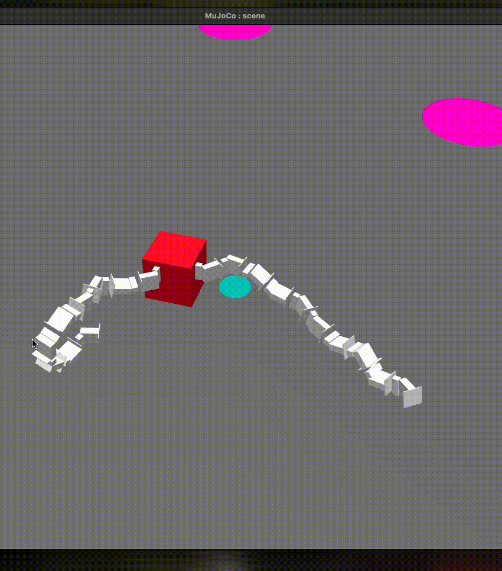

# AI Master Computational Intelligence
AI Master Project: Comparing learning with inherited controllers to learning from zero in evolutionary robots.

In this project we investigate whether evolutionary robots find better solutions when using some brain optimizer with and without inherted controllers from the previous generation in a waypoint navigation task. We will also analyze various morphological features to examine whether the different learning methods lead to significant evolutionary changes.

^ A fully evolved robot (learning done with controller inheritance) navigating from its spawn point (green) to multiple waypoints. \
*A smooth video render is available in `/Media`. Also note that these show sped-up motion. The video should represent motion over ~140-160 seconds in real life.*

## Installation/prerequisites
- Install [Revolve2_TL](https://github.com/eliparto/revolve2_TL); a modified version version of [Revolve2](https://github.com/eliparto/revolve2_TL) with changes to support targeted locomotion.
- `pip install` [plotille](https://github.com/tammoippen/plotille) for in-terminal fitness plots.
- `pip install matplotlib` for visualizing morphological features.

### Installation notes
This implementation has mainly been tested on MacOS and Ubuntu. On MacOS, `pip install cmake` had to be run before running `sh student_install.sh` per Revolve2's installation instructions.

On Ubuntu, `sudo apt install python3.11-dev` had to be run before running `sh student_install.sh`.

## Experimentation
Run `main.py` in the *Experiments* folder. Various parameters can be passed, for which explanations can be found through `python main.py -h`. `config.py` also contains many important parameters.

`run_deconstructed.py` contains a deconstructed script run without functions, which allows for variable and object exploration.

## Statistical testing
The scripts in the *Stat_analysis* folder contain the datasets and scripts used to perform the statistical tests discussed in the report.